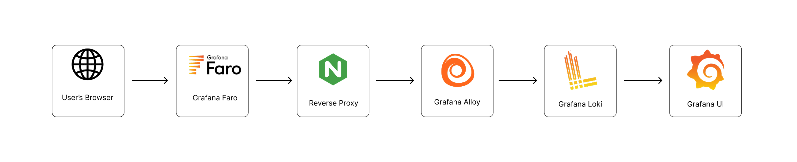
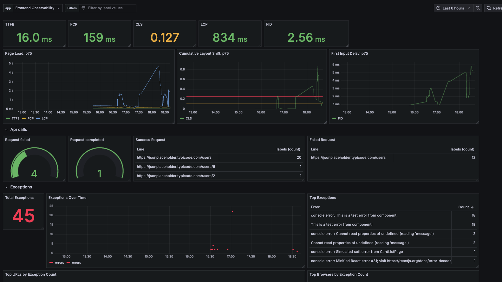
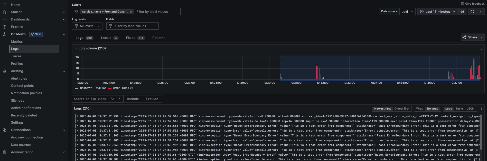

# Frontend Observability

<p align="center">
  <b>If you find this project useful, please consider giving it a ⭐ star on GitHub!</b>
</p>

---

> **Option 1: Use Grafana Cloud**
>
> For a fully managed observability stack, you can use Grafana Cloud instead of running Grafana, Loki, and Alloy locally. See the project setup and instructions in the [`feat/faro-grafana-cloud` branch](https://github.com/tmohammad78/frontend-monitor/tree/feat/faro-grafana-cloud).

A full-stack project featuring a React + TypeScript frontend (built with Vite), containerized with Docker, and integrated with Grafana, Loki, and Alloy for observability and monitoring.

## Features

- **Frontend:** React + TypeScript + Vite
- **Monitoring:** Grafana dashboards, Loki for logs, Alloy for telemetry collection
- **Containerized:** All services run via Docker Compose
- **Nginx:** Serves the frontend and proxies telemetry

---

## Architecture Overview

<p align="center">
  
</p>

This diagram shows how the frontend, Alloy, Loki, and Grafana interact. The React app sends telemetry and logs to Alloy, which forwards them to Loki. Grafana visualizes this data using pre-configured dashboards.

---

## Getting Started

### Prerequisites

- [Docker](https://www.docker.com/get-started)
- [Docker Compose](https://docs.docker.com/compose/)
- (Optional) [Node.js](https://nodejs.org/) and [npm](https://www.npmjs.com/) for local frontend development

---

### 1. Clone the Repository

```sh
git clone https://github.com/tmohammad78/frontend-monitor.git -b feat/faro-grafana-alloy
cd frontend-monitor
```

---

### 2. Start All Services

This will build and start the frontend, Grafana, Loki, and Alloy:

```sh
docker-compose up --build
```

- Frontend: [http://localhost:5173](http://localhost:5173)
- Grafana: [http://localhost:3000](http://localhost:3000) (default login: `admin` / `admin`)
- Alloy UI: [http://localhost:12345](http://localhost:12345)  
  You can use the **Graph** tab in Alloy UI to verify that Alloy is connected and receiving telemetry data.

---

### 3. Local Frontend Development

If you want to develop the frontend locally (with hot reload):

```sh
cd contact-app
npm install
npm run dev
```

Visit [http://localhost:5173](http://localhost:5173).

---

### 4. Linting & Building

- **Lint:** `npm run lint`
- **Build:** `npm run build`
- **Preview Production Build:** `npm run preview`

---

### 5. Observability

- **Grafana Dashboards:** Pre-configured dashboards for frontend metrics/logs. The dashboards and tables are defined in `infra/grafana/dashboards/` and are automatically loaded when you run `docker-compose up`.
- **Loki:** Log aggregation. Loki is set up as a data source for Grafana.
- **Alloy:** Telemetry collection and forwarding. You can access the Alloy UI at [http://localhost:12345](http://localhost:12345) and use the **Graph** tab to check connectivity.

#### Troubleshooting Grafana
- If you do not see the dashboards or tables automatically, you can manually import the `frontend-application.json` file from `infra/grafana/dashboards/` into Grafana.
- If Loki is not set as a data source, add it manually in Grafana (URL: `http://loki:3100`).

---

## Grafana Dashboard UI

<p align="center">
  
</p>

Grafana provides a rich dashboard UI for visualizing metrics and logs. The dashboards are auto-provisioned from the `infra/grafana/dashboards/` folder. You can view user activity, errors, and performance metrics in real time.

---

## Logs in Grafana

<p align="center">
  
</p>

All logs from the frontend are collected by Alloy and sent to Loki. In Grafana, you can use the “Explore” tab to query and view logs, filter by severity, and correlate logs with metrics and traces.

---

## Project Structure

- `contact-app/` — React frontend app (Vite, TypeScript)
- `infra/` — Nginx config, observability configs, Grafana dashboards
- `docker-compose.yml` — Orchestrates all services

---

## Customization

- **Nginx config:** `infra/nginx.conf`
- **Grafana dashboards:** `infra/grafana/dashboards/`
- **Alloy config:** `infra/alloy/config.alloy`

---

## Application Details (`App.tsx`)

- The main app (`App.tsx`) is intentionally written with some bad practices to help you observe performance and error monitoring:
  - **Increased LCP (Largest Contentful Paint):** The main image is loaded with a 5-second delay and a blocking button is provided to simulate main thread blocking.
  - **Increased CLS (Cumulative Layout Shift):** The image and content appear after a delay, causing layout shifts.
  - **Error Simulation:** The `/error` route throws an error to test error boundaries and logging. There are also simulated soft errors in the code.
  - **API Error Simulation:** Use the [Tweak extension](https://chrome.google.com/webstore/detail/tweak/ljfoeinjpaedjfecbmggjgodbgkmjkjk) to mock the API call to return a 500 status code if you want to see error logs in Grafana.
- **Routes:**
  - `/` — User list (with delayed image and blocking button)
  - `/detail/:id` — User detail page
  - `/error` — Throws an error and adds it to the DOM for error monitoring

---

## Contact

Feel free to contact me at **mohammad.taheri.developer@gmail.com**. I am always open to feedback, suggestions, and constructive criticism to improve this project!

---

## License

MIT
